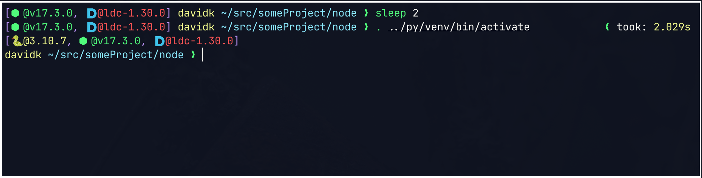

# searocket prompt



_NOTE: screenshot uses [nerd font with devicons](https://www.nerdfonts.com/),
this is not required._

[spaceship prompt](https://github.com/spaceship-prompt/spaceship-prompt) is
pretty good... but it was getting a bit sluggish for my liking. So I made this
slimmed down version which does all the heavy lifting in D.

## Build and install

It is recommended to use
[ldc](https://github.com/ldc-developers/ldc#installation), but
[dmd](https://dlang.org/download.html#dmd) is also supported.

Requires [dub](https://github.com/dlang/dub/releases) and `make` (technically
doesn't require make, you can just read the `Makefile` and do the same thing
manually).

Use the `PREFIX` and `ZSH_FILE_LOCATION` environment variables to set the prefix
and the location of the zsh file (or use the defaults.)

``` sh
make
PREFIX=/path/to/prefix ZSH_FILE_LOCATION=/path/to/searocket/zsh/file make install
```

You will need to source the `searocket.zsh` file from your `.zshrc`. E.g.:

``` sh
echo ". /path/to/searocket.zsh" >> ${ZDOTDIR:-$HOME}/.zshrc"
```

## Config

The basic idea is that all configuration is done at compile time. This would
require the user to have the [D toolchain](https://dlang.org/download.html)
setup.

Integrations can be enabled by adding to the `versions` array in `dub.json`.

Enabling more integrations will cause the prompt to be slower, but this is not
very perceptible.

### supported `versions` values

* Utility
  * `dir`
    * Print current directory
  * `exitcode`
    * Print what last command exited with (if it's not 0)
  * `user`
    * Print username
  * `jobs`
    * Is there a background job running
  * `took`
    * How long did the previous command take
  * `timing`
    * Total execution time for the prompt.
    * For debug only
  * `nogc`
    * Do not collect memory
    * I was unable to measure any performance difference when using this option
* Integrations
  * `bun`
  * `d`
  * `elm`
  * `git`
  * `go`
  * `nodejs`
  * `python`
  * `zig`
* Currently unsupported:
  * `battery`
  * `docker`
  * `elixir`
  * `haskell`
  * `java`
  * `julia`
  * `php`
  * `ruby`
  * `rust`
  * `swift`
  * `xcode`

### `source/config.d`

See [configOpts.md](configOpts.md) for the full list.


## License

Most of the code is written by me and licensed under the MIT license (see
`LICENSE` file).

Regular expressions used for parsing git status are from the spaceship prompt
project and are licensed under the MIT license (see [spaceship prompt
LICENSE.md](https://github.com/spaceship-prompt/spaceship-prompt/blob/master/LICENSE.md)).
