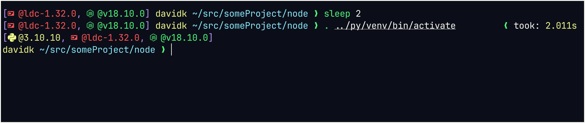

# searocket prompt



_NOTE: screenshot uses [nerd font with devicons](https://www.nerdfonts.com/),
this is not required._

[spaceship prompt](https://github.com/spaceship-prompt/spaceship-prompt) is
pretty good... but it was getting a bit sluggish for my liking. So I made this
slimmed down version which does all the heavy lifting in D.

## Build and install

[ldc](https://github.com/ldc-developers/ldc#installation) is required to build
due to the use of some non standard complier flags.

The prompt can be built using

``` sh
make
make install
```

You will need to source the generated `searocket.zsh` file from your `.zshrc`.
By default `/usr/share/searcoket/searocket.szh`, see
[Build flags](#build-flags) section for details.

``` sh
echo ".  /usr/share/searcoket/searocket.szh" >> ${ZDOTDIR:-$HOME}/.zshrc"
```

## Configuration

All configuration is done at compile time by enabling different compilation flags.

Features can be enabled by modifying the `UTILS` and `INTEGRATIONS` arrays
in `config.mk`.

Enabling more features will cause the prompt to be slower, but this is not
very perceptible.

### supported features

* `UTILS`
  * `dir`
    * Print current directory
  * `exitcode`
    * Print what last command exited with (if it's not 0)
  * `user`
    * Print username
  * `jobs`
    * Is there a background job running
  * `took`
    * How long did the previous command take
  * `timing`
    * Total execution time for the prompt.
    * For debug only
  * `nogc`
    * Do not collect memory
    * I was unable to measure any performance difference when using this option
* `INTEGRATIONS`
  * `bun`
  * `d`
  * `elm`
  * `git`
  * `go`
  * `nix`
  * `nodejs`
  * `python`
  * `zig`
* Currently unsupported:
  * `battery`
  * `docker`
  * `elixir`
  * `haskell`
  * `java`
  * `julia`
  * `php`
  * `ruby`
  * `rust`
  * `swift`
  * `xcode`

### `source/config.d`

See [configOpts.md](configOpts.md) for the full list.

### Build flags

| Variable            | default                     |
| ------------------- | --------------------------- |
| `DESTDIR`           | ` `                         |
| `PREFIX`            | `/usr`                      |
| `ZSH_FILE_LOCATION` | `${PREFIX}/share/searocket` |


`searocket` will be installed to `${DESTDIR}${PREFIX}/bin/searocket`.

`searocket.zsh` file will be installed to `${DESTDIR}${ZSH_FILE_LOCATION}/searocket.zsh`.

## License

Most of the code is written by me and licensed under the MIT license (see
`LICENSE` file).

Regular expressions used for parsing git status are from the spaceship prompt
project and are licensed under the MIT license (see [spaceship prompt
LICENSE.md](https://github.com/spaceship-prompt/spaceship-prompt/blob/master/LICENSE.md)).
